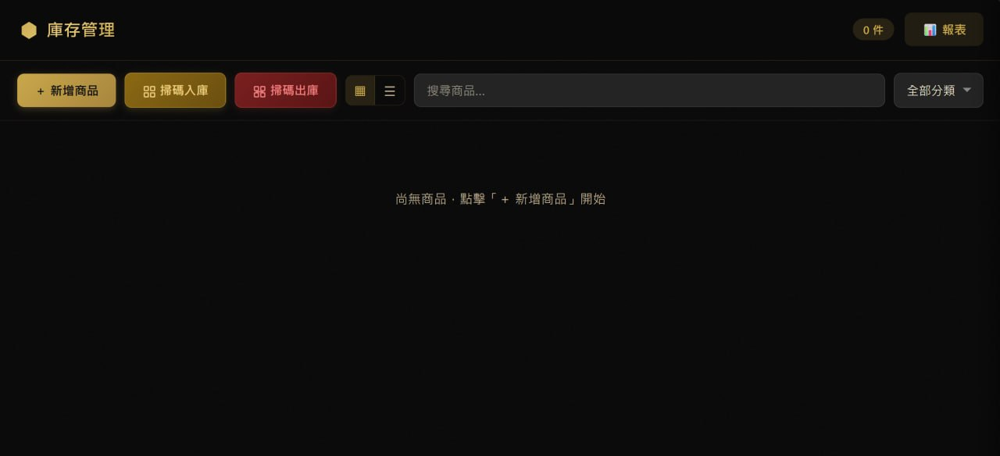

# 📦 Inventory Management System

FastAPI + SQLite 自架庫存管理系統，金色奢華暗色主題，支援條碼掃描、照片上傳、報表儀表板。


## ✨ 功能

- 📦 **商品 CRUD** — 名稱、條碼、數量、單位、成本、售價、品牌分類
- 📷 **照片上傳** — 客戶端自動壓縮（JPEG 70%，最大 1200px），支援拍照/選圖
- 🏷️ **品牌分類** — datalist 預設選項 + 自由輸入，分類標籤覆蓋在照片右上角
- 📊 **卡片 / 清單檢視** — 一鍵切換兩種顯示模式
- 📤 **JSON 匯出** / 📥 **JSON 匯入** — 完整備份/還原，支援 CSV 匯出
- 🖨️ **報表儀表板** — KPI 卡片、趨勢圖、分類圓餅圖、低庫存警示
- 🔍 **QR/條碼掃描** — html5-qrcode + ZXing，支援掃碼入庫/出庫
- 📱 **響應式手機版** — iPhone / Android 皆可操作
- 🎨 **金色奢華暗色主題** — 純黑底 + 金色強調，玻璃擬態卡片

## 📸 截圖



## 🚀 快速啟動

### Linux / macOS

```bash
git clone https://github.com/s90061/inventory.git ~/inventory && cd ~/inventory
pip install fastapi uvicorn python-multipart
python server.py
```

### Windows (Command Prompt)

```cmd
git clone https://github.com/s90061/inventory.git %USERPROFILE%\inventory
cd %USERPROFILE%\inventory
pip install fastapi uvicorn python-multipart
python server.py
```

### Windows 一鍵啟動

雙擊 `start.bat` — 自動偵測並安裝缺少的 Python 相依套件，啟動伺服器。

### Windows（免安裝 Python — embeddable）

無管理員權限時，使用 [Python embeddable package](https://www.python.org/downloads/windows/)：

1. 下載 `python-3.11.x-embed-amd64.zip`，解壓至 `C:\inventory\python\`
2. 編輯 `python311._pth`，取消註解 `import site`
3. 執行 `python get-pip.py` 安裝 pip
4. `python -m pip install fastapi uvicorn python-multipart`
5. `git clone https://github.com/s90061/inventory.git C:\inventory\app`
6. `cd C:\inventory\app && ..\python\python.exe server.py`

---

開啟 **http://localhost:8090** 即可使用。

## 🏗️ 專案結構

```
inventory/
├── server.py              # FastAPI 後端，SQLite 資料庫
├── start.bat              # Windows 一鍵啟動（自動安裝相依）
├── static/
│   ├── index.html         # 主頁面
│   ├── app.js             # 主要邏輯
│   ├── style.css          # 金色奢華暗色主題
│   ├── report.html        # 報表儀表板
│   ├── report.js          # 報表邏輯 + 圖表
│   ├── report.css         # 報表專用樣式
│   ├── html5-qrcode.min.js
│   ├── zxing-browser.min.js
│   └── zxing-library.min.js
├── uploads/               # 商品照片（自動建立）
└── inventory.db           # SQLite 資料庫（自動建立）
```

## 🔌 REST API

### 商品管理

| Endpoint | Method | Description |
|----------|--------|-------------|
| `/api/products` | GET | 列出商品（`?search=` `?category=`） |
| `/api/products/<id>` | GET | 單一商品詳情 |
| `/api/products` | POST | 新增商品（FormData） |
| `/api/products/<id>` | PUT | 更新商品（FormData） |
| `/api/products/<id>` | DELETE | 刪除商品 + 照片 |

### 庫存操作

| Endpoint | Method | Description |
|----------|--------|-------------|
| `/api/products/<id>/adjust` | POST | 進貨/出貨（`change: +N/-N`） |
| `/api/products/<id>/photo` | POST | 上傳/替換照片 |
| `/api/products/<id>/photo` | DELETE | 移除照片 |

### 掃碼

| Endpoint | Method | Description |
|----------|--------|-------------|
| `/api/scan` | POST | 掃碼入庫（自動 +1） |
| `/api/scan-out` | POST | 掃碼出庫（自動 -1） |

### 匯出入 / 報表

| Endpoint | Method | Description |
|----------|--------|-------------|
| `/api/categories` | GET | 所有品牌分類 |
| `/api/export` | GET | 下載 JSON（`?fmt=csv` 可選） |
| `/api/import` | POST | 上傳 JSON（upsert） |
| `/api/report/summary` | GET | KPI + 低庫存 + 分類統計 |
| `/api/report/trends` | GET | 每日進出貨趨勢（`?days=30`） |

## 🎨 自訂

### 品牌分類

編輯 `static/index.html` 中的 `<datalist id="category-list">`：

```html
<datalist id="category-list">
  <option value="您的品牌 A">
  <option value="您的品牌 B">
  <option value="您的品牌 C">
</datalist>
```

### 色彩主題

修改 `static/style.css` 中的 CSS 變數：

```css
:root {
  --bg: #0a0a0a;          /* 頁面背景 */
  --bg-card: #1a1a1a;    /* 卡片背景 */
  --gold: #c9a84c;        /* 主強調色 */
  --text: #f0ead6;        /* 主文字 */
  --text-muted: #c0b395;  /* 次要文字 */
}
```

### 伺服器埠

修改 `server.py` 中的 port：

```python
uvicorn.run(app, host="0.0.0.0", port=8090)
```

## ⚙️ 背景執行

### Linux（systemd）

```bash
cat > /tmp/inventory.service << 'EOF'
[Unit]
Description=Inventory Management System
After=network.target

[Service]
Type=simple
User=YOUR_USER
WorkingDirectory=/home/YOUR_USER/inventory
ExecStart=/usr/bin/python3 server.py
Restart=on-failure
RestartSec=5

[Install]
WantedBy=multi-user.target
EOF

sudo cp /tmp/inventory.service /etc/systemd/system/
sudo systemctl enable --now inventory
```

### Linux / macOS（nohup）

```bash
cd ~/inventory
nohup python server.py > /dev/null 2>&1 &
```

### Windows（背景啟動）

修改 `start.bat`，將 `python server.py` 改為：

```bat
start /B python server.py
```

或用 [NSSM](https://nssm.cc/) 註冊為 Windows 服務。

## 📱 手機使用

- 手機與伺服器在同一區網，連線 `http://伺服器IP:8090`
- 支援 iPhone Safari / Android Chrome
- 掃碼功能需 HTTPS 或 localhost（Chrome 限制），區網可用 Safari

## 🛠️ 技術棧

- **Backend**: Python 3.11+ / FastAPI / SQLite（WAL mode）
- **Frontend**: Vanilla HTML / CSS / JS（零框架）
- **Charts**: Chart.js 4（CDN 載入）
- **Barcode**: html5-qrcode + @zxing/browser
- **零建構步驟** — clone 即跑

## 📋 系統需求

- Python 3.11+
- pip
- 現代瀏覽器（Chrome / Safari / Firefox / Edge）

## 📄 License

MIT
